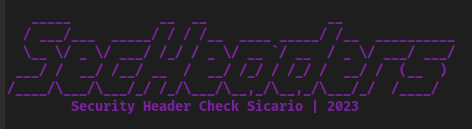

# Security Headers Checker
[](https://www.python.org/) 




Security Headers Checker is a command-line tool to check the security headers of a website. It helps identify missing or misconfigured security headers that can leave a website vulnerable to various attacks.

## Installation

1. Clone the repository:


```
git clone https://github.com/your-username/security-headers-checker.git
cd security-headers-checker
```

2. Install the required dependencies:

```

pip install -r requirements.txt
```
3. Run script

```
python security_headers_checker.py
```
4. Enter the target URL when prompted. The tool will check the security headers of the target website and display the results.

If you would like to output results to a html file, use the following syntax: 

```
python security_headers_checker.py -o 
```
check the current directory for the omitted file.


# Contributing

Contributions are welcome! If you find any issues or have suggestions for improvements, please open an issue or submit a pull request.

License

[](http://www.gnu.org/licenses/gpl-3.0) [](https://saythanks.io/to/stanislav-web)  


This project is licensed under the MIT License.
